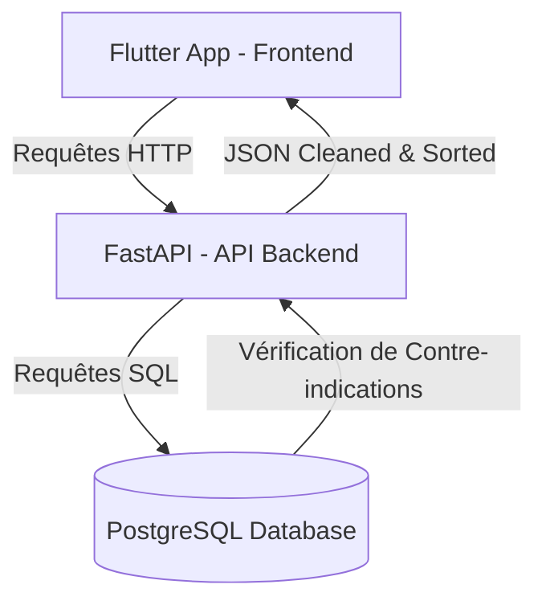

<p align="center">
  
</p>

<h1 align="center">OncoNutrition</h1>

<p align="center">
  <strong>Application de recommandation nutritionnelle intelligente pour les patients en oncologie.</strong><br>
  <em>Développée dans le cadre d'un stage d'initiation au sein du CHU Hassan II – Fès.</em>
</p>

<p align="center">
  <a href="https://github.com/DandaneRida/OncoNutrition/stargazers">
    
  </a>
  <a href="https://github.com/DandaneRida/OncoNutrition/network/members">
    
  </a>
</p>

<p align="center">
  
  
  
  
</p>

---

## Contexte & Cadre du Projet

Cette application a été entièrement pensée et développée durant un **stage d'initiation au sein du Centre Hospitalier Universitaire (CHU) Hassan II de Fès**. 

L'objectif principal était de concevoir un outil numérique d'accompagnement thérapeutique capable d'aider les patients suivis en oncologie à adapter leur alimentation quotidienne face aux effets secondaires des traitements (chimiothérapie, radiothérapie, etc.), tout en facilitant le travail de sensibilisation des équipes soignantes.

---

## Présentation du Projet


**OncoNutrition** est une application full-stack (Web & Mobile) qui propose des recommandations personnalisées basées sur les données cliniques et les symptômes déclarés en temps réel par l'utilisateur.

### Problématique & Solution
Certains antioxydants, notamment les **polyphénols**, jouent un rôle protecteur majeur durant le parcours de soins. À l'inverse, de nombreux plats peuvent aggraver les troubles digestifs ou la fatigue des patients.

**L'algorithme d'OncoNutrition filtre intelligemment les données :**
1. Le patient coche ses symptômes actuels (ex: Nausées, Perte d'appétit).
2. L'API **exclut automatiquement** toutes les recettes contre-indiquées pour ces symptômes spécifiques.
3. Les recettes sûres restantes sont **classées par ordre décroissant de teneur en polyphénols** pour maximiser l'apport nutritionnel bénéfique.

---

## Fonctionnalités Clés

* **Authentification Sécurisée :** Inscription avec hachage robuste des mots de passe (`bcrypt`) et connexion par jeton d'authentification.
* **Gestion Active des Symptômes :** Choix et mise à jour dynamique des symptômes du patient depuis son profil Flutter.
* **Recommandation Intelligente & Filtrage :**
  * **Exclusion automatique :** Filtrage via une requête SQL d'exclusion croisant les tables `recettes`, `recette_symptomes` et `utilisateur_symptome`.
  * **Filtrage par Catégories :** Possibilité de choisir une sous-catégorie de plat (ex: *Soupes*) ou d'afficher *"Toutes les catégories"*.
  * **Tri par Polyphénols :** Mise en avant prioritaire des recettes les plus riches en antioxydants.
  * **Limite Dynamique (n) :** Possibilité de configurer l'affichage entre 1 et 10 recettes maximum.

---

## 🛠️ Architecture Technique



---

## Guide d'Installation Rapide

### 1. Configuration Globale & Base de données

**Prérequis :**
* Python 3.10+
* Flutter SDK
* PostgreSQL

**Variables d'environnement :**
Créez un fichier `.env` à la racine du projet :

```env
DB_USER_DEV=votre_utilisateur
DB_PASSWORD_DEV=votre_mot_de_passe
DB_HOST_DEV=localhost
DB_PORT_DEV=5432
DB_NAME_DEV=onconutrition_db
```

### 2. Lancement du Backend (FastAPI)

1. Rendez-vous dans le dossier backend :
```bash
cd backend
```
2. Installez les dépendances requises :
```bash
pip install fastapi uvicorn sqlalchemy psycopg2 bcrypt pydantic[email]
```
3. Démarrez le serveur FastAPI :
```bash
uvicorn main:app --reload
```
> 🔗 Documentation API disponible sur : http://127.0.0.1:8000/docs

### 3. Lancement du Frontend (Flutter)

1. Rendez-vous dans le dossier frontend :
```bash
cd frontend
```
2. Récupérez les packages Dart :
```bash
flutter pub get
```
3. Lancez l'application sur votre navigateur ou émulateur :
```bash
flutter run -d chrome
```

---

## Sécurité et Bonnes Pratiques
* **Hachage à sens unique :** Les mots de passe sont sécurisés via `bcrypt` (avec génération automatique de `salt`) avant leur stockage en base de données.
* **Protection contre les Injections SQL :** Utilisation systématique de requêtes préparées via l'objet `text()` de SQLAlchemy.
* **Gestion CORS :** Configuration stricte du middleware CORS pour sécuriser les requêtes clients.

---

## Équipe & Encadrement
* **Organisme d'accueil :** Centre Hospitalier Universitaire (CHU) Hassan II – Fès, Maroc 
* **Développeur :** [@DandaneRida](https://github.com/DandaneRida)
* **Encadré par :** Mr. KARYM CHAKIB  — *CHU Hassan II*

---
